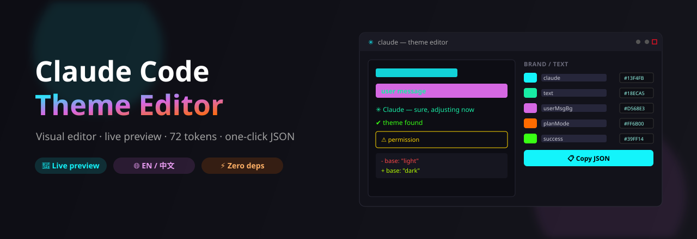

<div align="center">

# 🎨 Claude Code 主题编辑器

**[Claude Code](https://claude.com/claude-code) 自定义主题的可视化编辑器 —— 选颜色、实时预览、一键复制 `theme.json`。**

[English](./README.md) | 简体中文

[](https://feif-l.github.io/claude-code-theme-editor/)
&nbsp;
[](./LICENSE)
&nbsp;




</div>

---

## ✨ 这是什么?

一个**单 HTML 文件**,让你可视化地设计 Claude Code 配色主题。右侧拖调色盘,左侧模拟的 Claude Code 终端实时更新,选好后一键导出 `theme.json`。

无需构建、无依赖、无服务器。打开文件(或 [在线版](https://feif-l.github.io/claude-code-theme-editor/))就能用。

## 🚀 快速开始

**方式 A —— 在线用**

👉 **[打开在线编辑器](https://feif-l.github.io/claude-code-theme-editor/)**

**方式 B —— 本地跑**

```bash
git clone https://github.com/FEIF-L/claude-code-theme-editor.git
cd claude-code-theme-editor
# 浏览器直接打开 index.html —— 无需安装
```

然后:

1. 右侧改颜色,左侧看预览。
2. 按需切换 **简单 / 完整** 和 **中 / EN**。
3. 点 **复制 JSON 到剪贴板**。
4. 存成主题文件:
   - macOS / Linux → `~/.claude/themes/my-theme.json`
   - Windows → `%USERPROFILE%\.claude\themes\my-theme.json`
5. 在 Claude Code 里运行 `/theme` 选它。保存即热重载,无需重启。

## 🎯 功能

| | |
|---|---|
| 🎲 **随机主题** | 一键用种子生成好看、带对比度检查的配色 —— 可复现,绝不难用 |
| 🖼️ **实时预览** | 模拟的 Claude Code 终端实时反映每一处改动 |
| 🎚️ **拖拽调色盘** | 每个 token 都有调色盘 + hex 输入框,双向同步 |
| 🔀 **简单 / 完整 模式** | 约 15 个常用 token,或全部 **72 个**(含内部键) |
| 🌐 **中英双语界面** | 随时切换 English ↔ 中文 —— 标签、说明、预览全跟着变 |
| 📋 **一键导出** | 复制 JSON 到剪贴板,或下载 `.json` |
| ⚠️ **问题标记** | 有上游 bug 的 token 会标出来,不踩坑 |

## 🎨 主题文件格式

```json
{
  "name": "My Theme",
  "base": "dark",
  "overrides": {
    "claude": "#13F4FB",
    "text": "#18ECA5",
    "userMessageBackground": "#D568E3"
  }
}
```

- **`name`** —— 显示名。
- **`base`** —— `dark` 或 `light`;没覆盖的 token 都从这个预设继承。
- **`overrides`** —— 72 个 token 的任意子集。不认识的键会被忽略,所以全导出 72 个也安全。

## 📚 Token 参考

**共 72 个 token** —— 61 个官方文档化,11 个是逆向出来的内部键(Claude Code v2.1.x)。分组:品牌 · 文字 · 状态 · 输入框/模式 · Diff · 全屏背景 · 子代理调色板 · 速率条 · Brief 模式 · Clawd 吉祥物 · 彩虹。

完整键名 + 说明在编辑器「完整」模式里。Token 列表来源:[cameronsjo 的 gist](https://gist.github.com/cameronsjo/34a6fb8ade2b44c8380e1a2adebbac2b)。

## ⚠️ 已知问题(上游 bug,非本工具)

编辑器里用 ⚠ 标记:

- **Diff 颜色可能不生效** —— `diffAdded` / `diffRemoved` 等键在部分版本被静默忽略,会去读 base 主题而不是你的 override。见 [#71543](https://github.com/anthropics/claude-code/issues/71543)、[#85821](https://github.com/anthropics/claude-code/issues/85821)。
- **用户消息文字色无法单独设置** —— 没有专属键,它用全局 `text` 色。如果 `userMessageBackground` 很亮,注意 `text` 要跟它有足够对比。
- **`messageActionsBackground`** —— v2.1.140 起已移除,override 被忽略。

## 🗺️ 路线图

- [x] 🎲 **随机种子** —— 一键生成好看又能用的配色(带对比度检查,绝不整屏全白)
- [ ] 🖥️ Light 主题预览支持
- [ ] 📦 社区主题画廊
- [ ] ♿ 内置每个 token 的 WCAG 对比度检查

## 🤝 参与贡献

欢迎 issue 和 PR。整个项目就是一个自包含的 `index.html`,没有工具链要配。改完浏览器打开即可。

## 📄 许可

[MIT](./LICENSE)
